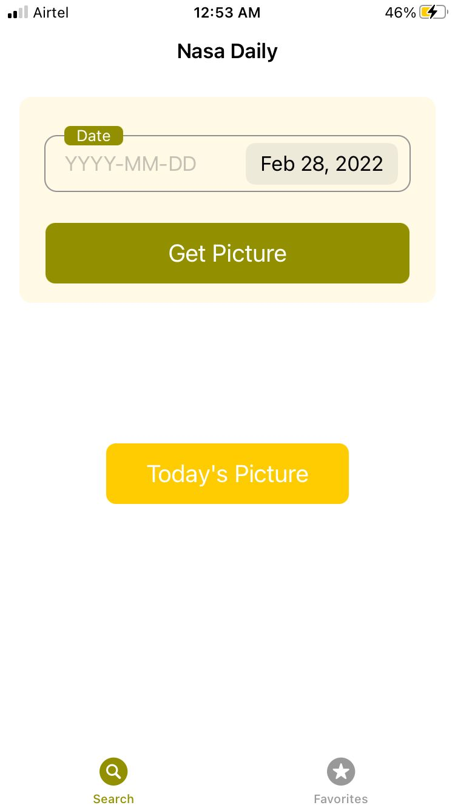
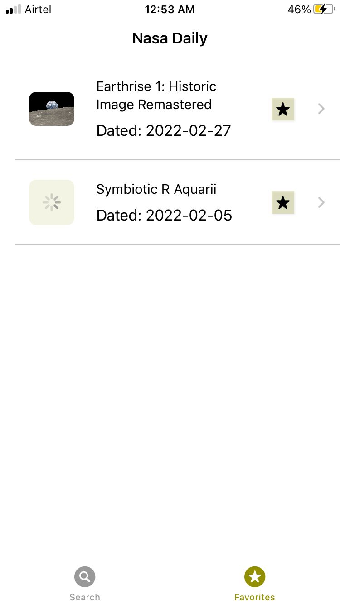
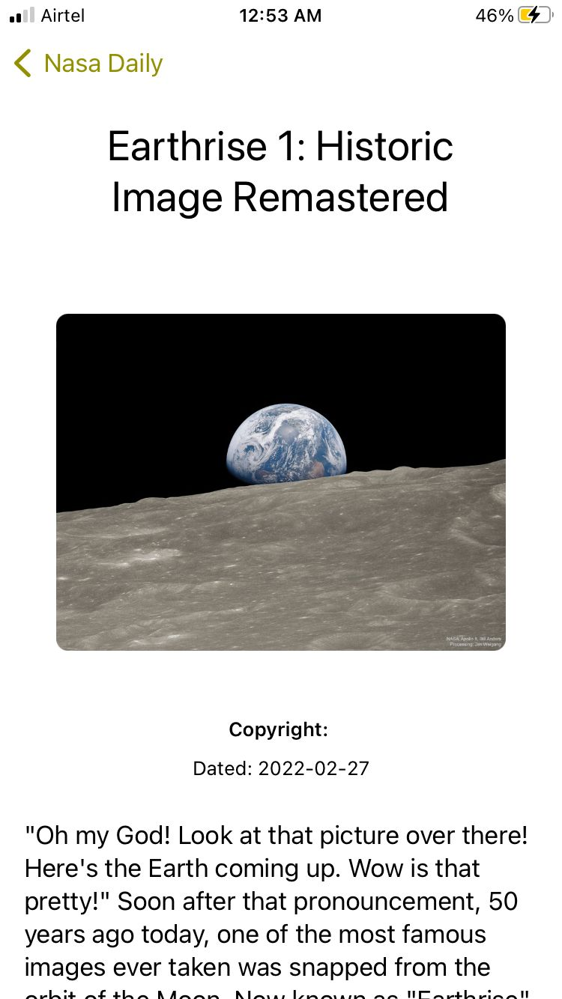

# NasaDaily
 Nasa - Astronomy Pic of the day, assignment project.
 
 The App uses NASA’s open APIs ( https://api.nasa.gov/ ) and in particular, the APOD ( Astronomy picture of the day ) resource to fetch the data from the service.

### Steps To Run: 
- There is no additonal setup to be done inorder to run app on simulator.
- You will have to change the bundle identifier to run on a physical device.

### Screenshots

Thank You :)
